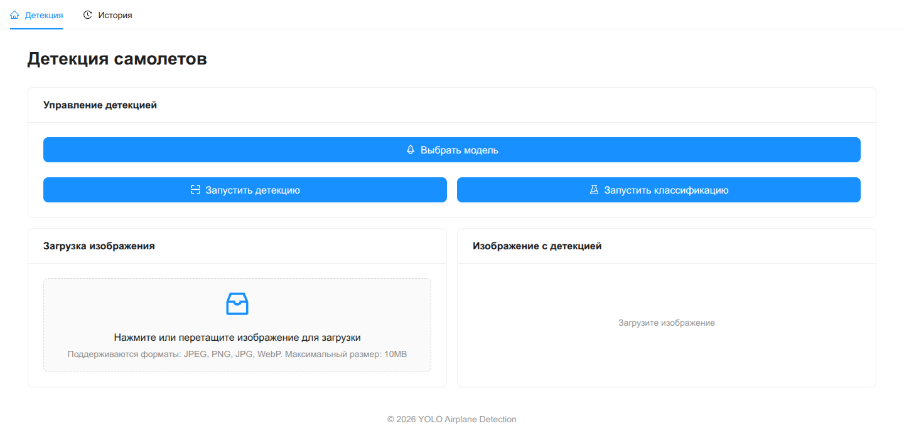
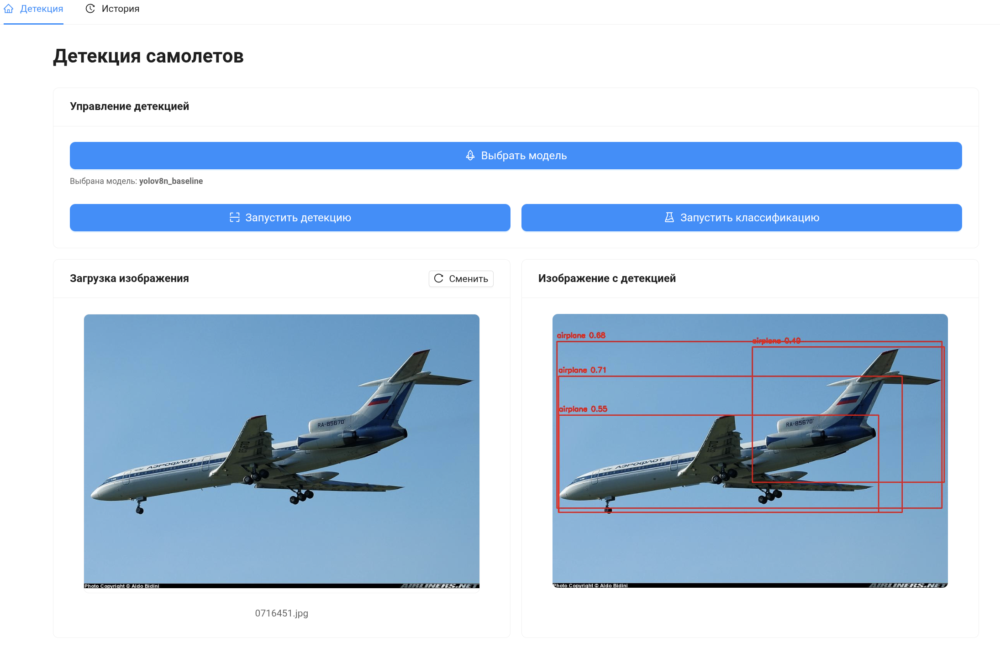
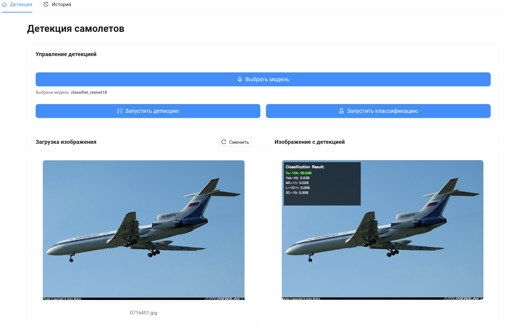

# Демонстрация веб-приложения YOLO Airplane Detection

## 1. Главная страница — Детекция

Главная страница приложения. Содержит:

- **Навигация**: вкладки «Детекция» и «История»
- **Управление детекцией**: кнопки «Выбрать модель», «Запустить детекцию», «Запустить классификацию»
- **Загрузка изображения**: drag-and-drop зона для загрузки изображений (JPEG, PNG, JPG, WebP, до 10MB)
- **Результат**: область для отображения изображения с детекцией

## 2. Модальное окно выбора модели — Детекторы

Модальное окно «Выберите модель» с двумя секциями:

- **Стандартные модели**: YOLOv8n (pretrained) — предобученная на COCO
- **Модели из MLflow**: 5 детекторов, отсортированных по mAP50
  - yolov8n_mod1 — mAP50: 70.44%, mAP50-95: 44.41%
  - yolov8n_mod2 — mAP50: 68.99%, mAP50-95: 41.16%
  - И ещё 3 модели с разными метриками

Каждая карточка показывает: название, тип, эпохи, mAP50, mAP50-95, формат (PyTorch).

## 3. Модальное окно выбора модели — Классификаторы

Вкладка «Классификаторы» с 3 моделями ResNet18:

- classifier_resnet18 (100 эпох) — Accuracy: 69.58%, Top-5: 92.35%
- classifier_resnet18 (200 эпох) — Accuracy: 68.47%, Top-5: 91.72%
- classifier_resnet18 (10 эпох) — Accuracy: 12.78%, Top-5: 41.70%

## 4. MLflow — Главная страница

Главная страница MLflow UI:

- Эксперимент `yolov8_airplane_detection` создан 12.04.2026
- Секции: Tracing, Evaluation, Prompts, AI Gateway, Model Training

## 5. MLflow — Список запусков

Таблица всех 8 запусков:
| Run Name | Duration | Source |
|---|---|---|
| yolov8n_mod2 | 46.6min | train_detector.py |
| classifier_resnet18 | 2.0h | train_classifier.py |
| yolov8n_mod1 | 46.1min | train_detector.py |
| classifier_resnet18 | 1.0h | train_classifier.py |
| yolov8n_mod1 | 32.3min | train_detector.py |
| classifier_resnet18 | 6.7min | train_classifier.py |
| yolov8n_mod2 | 14.6min | train_detector.py |
| yolov8n_mod1 | 15.9min | train_detector.py |

## 6. MLflow — Детали запуска (Overview)

Страница конкретного запуска `yolov8n_mod2`:

- **Статус**: Finished
- **Duration**: 46.6min
- **Source**: train_detector.py
- **27 метрик**: system metrics (disk, memory), training metrics
- **12 параметров**: device, epochs, imgsz, batch и др.

## 7. MLflow — Model Metrics

Графики метрик модели по секциям:

- **final**: box_loss, cls_loss, dfl_loss, mAP50, mAP50-95, precision, recall
- **train**: training loss по эпохам
- **val**: validation loss и метрики по эпохам

## 8. MLflow — Artifacts

Файловая структура артефактов:

- `detection_examples/` — 5 примеров детекции (jpg)
- `model_yolov8n_mod2/` — MLflow модель (MLmodel, conda.yaml, python_model.pkl)
- `onnx/` — ONNX экспорт модели
- `best.pt`, `last.pt` — веса модели
- `confusion_matrix.png`, `results.png`, `labels.jpg` — визуализации

## 9. Страница Истории

Страница истории детекций — пуста (детекции ещё не выполнялись). Показывает placeholder с иконкой.

---

## Технический стек

| Компонент | Технологии                                     |
| --------- | ---------------------------------------------- |
| Frontend  | React + Vite + TypeScript + Ant Design         |
| Backend   | Django REST Framework + Python                 |
| ML        | YOLOv8 (Ultralytics), ResNet18 (PyTorch), ONNX |
| Tracking  | MLflow + MinIO (S3-хранилище)                  |
| Infra     | Docker Compose                                 |

## Модели в репозитории

| Модель                  | Тип           | mAP50 / Accuracy         | Формат         |
| ----------------------- | ------------- | ------------------------ | -------------- |
| yolov8n_mod1 × 3        | Детектор      | 70.44% / 56.12% / 54.27% | PyTorch + ONNX |
| yolov8n_mod2 × 2        | Детектор      | 68.99% / 56.05%          | PyTorch + ONNX |
| classifier_resnet18 × 3 | Классификатор | 69.58% / 68.47% / 12.78% | PyTorch + ONNX |
