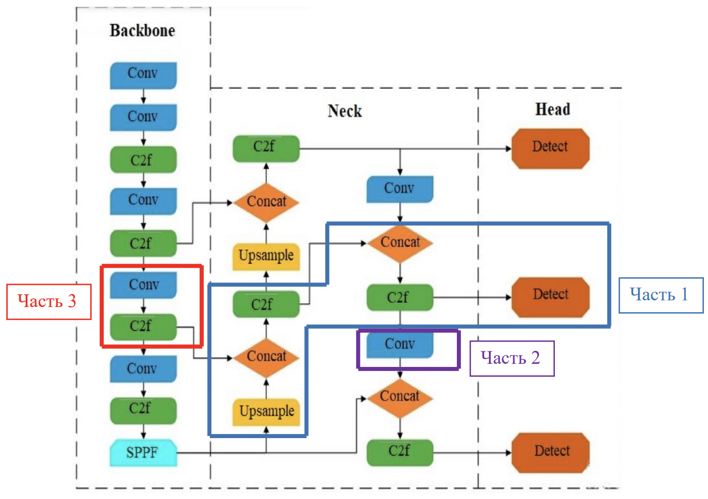
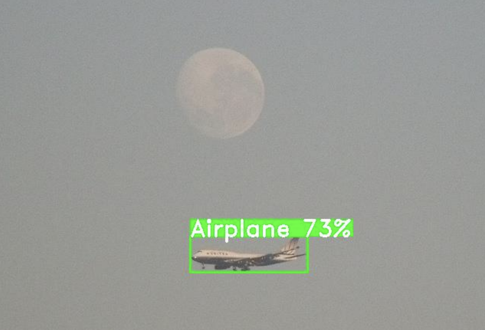
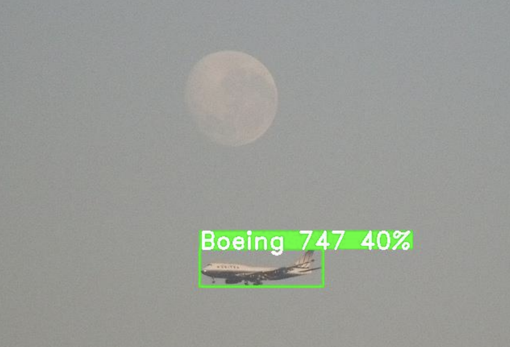

# Тестовое задание

## На позицию «Инженер компьютерного зрения»

### Лаборатория 3010

---

## 1. Обучение модели детектора

**Цель задания** — обучить нейросетевую модель на базе YOLO [2] для детекции объектов на изображении. Провести модификацию модели в соответствии с требованиями, сравнить результаты обучения различных модификаций на предмет качества и скорости работы.

### 1.1 Подготовка датасета

Для обучения модели YOLO подготовить датасет для распознавания объектов типа «Самолет».

В качестве базового датасета использовать набор данных COCO [1].

### 1.2 Обучение базовой модели

Обучить модель размера nano на подготовленных данных. В качестве базовой архитектуры рекомендуется выбрать YOLOv8.

### 1.3 Модификация модели

> **Примечание:** Выполнение заданий в разделах 1.3 и 1.4 может потребовать больше времени и усилий, поэтому предлагается сначала выполнить задания разделов 2 и 3, а затем, при возможности, вернуться к данным пунктам.

На рисунке 1 представлена структурная схема для модели YOLOv8 с указанием нескольких частей. Необходимо подготовить две модифицированные модели:

- **Первая модель** — содержит все элементы кроме части 1.
- **Вторая модель** — содержит все элементы кроме частей 1, 2 и 3.



_Рисунок 1. Структурная схема нейросетевой модели YOLOv8_

### Описание выделенных частей архитектуры

**Часть 1** (синяя рамка) — путь обработки признаков через Neck к Head:

```
Upsample (Neck) → Concat (Neck) → C2f (Neck) → Concat (Neck) → C2f (Neck) → Detect (Head)
```

Данный путь отвечает за объединение признаков разного масштаба и передачу их в детектор.

**Часть 2** (фиолетовая рамка):

````
Conv (Neck)
```д
Свёрточный слой в блоке Neck для преобразования признаков.

**Часть 3** (красная рамка) — блок в Backbone:
````

Conv (Backbone) → C2f (Backbone)

```
Извлечение признаков на ранней стадии в Backbone через свёрточный слой и C2f блок.

### 1.4 Анализ

Провести анализ по результатам обучения трех моделей. Оценить влияние внесенных модификаций на качество и скорость работы. Результат работы представить в виде подробного научно-технического отчета.

---

## 2. Подготовка модели и кода для запуска в среде ONNX Runtime

**Цель задания** — произвести экспорт моделей, обученных в задании 1, в формат ONNX и привести код для запуска базовой ONNX модели на тестовых данных.

### 2.1 Экспорт модели

Экспортировать все три модели в формат ONNX [3].

### 2.2 Подготовка кода

Подготовить код для запуска базовой, не модифицированной модели в среде ONNX Runtime [4]. Допустимо использовать Python или C++.

Результатом алгоритма должна быть отрисовка на изображении ограничивающей рамки объекта и степени уверенности.


*Рисунок 2. Пример результата работы алгоритма детекции*

---

## 3. Обучение модели классификатора

**Цель задания** — обучение модели, уточняющей класс объекта, предсказанный моделью из пункта 2, и адаптация кода из пункта 2 для запуска в среде ONNX Runtime.

### 3.1 Подготовка датасета

Подготовить датасет для классификации объектов типа «Самолет» [5, 6].

### 3.2 Обучение модели классификатора

Обучить любую предпочтительную нейросетевую модель для классификации типа/класса объекта на подготовленном датасете. В дальнейшем данная модель должна производить классификацию объекта на основе вырезанной области соответствующей объекту из базового изображения.

### 3.3 Подготовка кода

Произвести экспорт модели в формат ONNX. Использовать код из пункта 2, внедрить модель классификации таким образом, чтобы по итогу запуска алгоритма на изображении отображалась ограничивающая рамка, степень уверенности и имя уточненного класса объекта.

- Рамка должна определяться моделью, обученной в пункте 1.2.
- Классификация должна производиться моделью, обученной в пункте 3.2, на основе вырезанной части изображения.


*Рисунок 3. Пример результата работы алгоритма детекции и классификации*

---

## Ссылки

1. https://cocodataset.org/#home
2. https://docs.ultralytics.com/
3. https://onnx.ai/
4. https://onnxruntime.ai/
5. https://docs.pytorch.org/vision/main/generated/torchvision.datasets.FGVCAircraft.html
6. https://www.robots.ox.ac.uk/~vgg/data/fgvc-aircraft/
```
